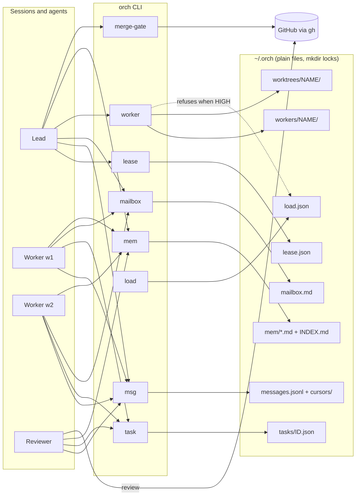

# ORCH-os

**Run several CLI coding agents as one team: one lead, addressed messages, claimed tasks, one merge gate, and notes that outlive a session.**

Author: Winnicent Zuo, Acephalt Inc. · [English](README.md) · [中文](README.zh.md)

## Quickstart

```sh
npx orch-os init          # detect agent CLIs, write ~/.orch/config.toml, the mailbox and the handbook
npx orch-os doctor        # PASS/FAIL per prerequisite
npm i -g orch-os          # or install the `orch` command for good
```

Without the npm registry, run it straight from GitHub (builds on first run), or install from a clone:

```sh
npx github:Acephalt-Inc/orch-os init
git clone https://github.com/Acephalt-Inc/orch-os && cd orch-os && sh install.sh
```

Then try it. The examples use `orch`, which a global install puts on your PATH; without one, write `npx orch-os` in its place (`npx orch-os agents`, `npx orch-os lease acquire --session lead`, …):

```sh
orch agents                                    # which agent CLIs were found and configured
orch lease acquire --session lead              # this terminal takes the lead role
orch task claim parser-fix --as w1             # w1 owns the task; nobody else can claim it
orch msg send QUESTION --as w1 --to lead -m "Keep the old flag?"
orch msg read --as lead                        # lead's pending messages
orch worker start w1 --agent claude --worktree --task task.md   # detached worker in its own git worktree
orch merge-gate 101 --fixture approved         # offline demo of the merge gate
orch mem add review-at-head -t rule -d "Approvals count only for the current head commit"
```

Node.js 20 or newer, macOS or Linux. No runtime dependencies. Installing from a clone is under [Install](#install).

### Solo flow: one GitHub account, several agents

GitHub does not let a PR's author approve it, so when every agent pushes and reviews as the same account, a normal approval is impossible and the default gate never passes. Switch the gate to **review comments**: a PR comment whose first line is `ORCH-REVIEW APPROVE <full head sha> by <agent>`. It counts only for the PR's current head commit, and only when `<agent>` is not the holder of the PR's task in `orch task`.

```sh
orch task claim parser-fix --as w1             # w1 writes the change and opens PR 101
orch review approve 101 --as r1                # r1 reviewed the head; posts the review comment through gh
orch merge-gate 101 --reviews comments --task parser-fix   # PASS: CI green, r1 != w1, review comment is for the head
```

`orch review changes` and `orch review reject` post the blocking forms. Set `[review] source = "comments"` in `~/.orch/config.toml` to make it the default. Offline demo: `orch task claim demo --as w1 && orch merge-gate 101 --fixture comment-approved --reviews comments --task demo`.

**This is a process gate, not a security boundary.** It keeps cooperating agents honest about who reviewed what and at which commit. It does not stop anyone who holds the account's token: they can post a review comment under any agent name. If you need an approval that an author cannot produce, give the reviewer its own GitHub account or app identity and keep the default `github` source.

## What it does, and who it helps

ORCH-os is for people who already use a CLI coding agent (Claude Code, Codex CLI, Gemini CLI, …) and now run **more than one at a time on the same repository**. That brings problems a single agent does not have:

| Problem with several agents | What ORCH-os does |
|---|---|
| Two terminals both act as the lead and give conflicting instructions | A **role lease**: one session holds the lead role. Taking it from an unexpired holder needs `--force`, and every change of holder bumps an epoch that fences off the old one. |
| Questions between agents get lost; nobody knows what was answered | **Addressed messages** (`orch msg`): `QUESTION`, `ANSWER`, `DONE`, `BLOCKED`, sent to a name or to everyone, with a read cursor and acks per reader, and `msg watch` to wait for the next one. |
| Two workers pick up the same task | **Task claims** (`orch task`): exactly one holder per task, fenced by an epoch; a claimed task cannot be taken until it is released or expires. |
| Workers overwrite each other's files | **A git worktree per worker**: `orch worker start --worktree` gives each worker its own branch and directory; `stop` removes it only if it is clean. |
| A PR merges on an approval of an older commit, or on the author's own say-so | A **merge gate** on GitHub reviews: CI green, enough non-author approvals of the PR's current head commit, and no outstanding "changes requested". Agents that share one GitHub account use review comments instead (see [Solo flow](#solo-flow-one-github-account-several-agents)). |
| Background agents are orphaned, run forever, or cannot be stopped cleanly | **Workers**: each is a detached process in its own process group, with a time limit, a nice level, a log directory, and a stop that reaches the whole group. |
| Many agents plus test runs overload the machine | A **load governor**: per-core load and swap (and optionally temperature) map to four tiers with hysteresis. New workers are refused while load is HIGH. |
| Every session starts from zero | **Long-lived notes** (`orch mem`): one Markdown file per rule or lesson, a capped index read at session start, and retire-with-successor instead of delete. |
| Every team reinvents how agents should behave | **A handbook**: `orch init` writes four files: boot files for the lead, worker and reviewer roles, and the shared protocols, for Claude Code, Codex CLI or any agent that reads instructions. |

ORCH-os does not replace your agent. It decides who leads, how agents talk, who owns which task, where workers run, what the team keeps knowing, and whether a PR may merge.

## Features

| Feature | Command | Details |
|---|---|---|
| Setup | `orch init`, `orch agents` | Finds known agent CLIs on PATH and in common install dirs cron does not see; writes `[agents.*]` with absolute paths; writes the mailbox and the handbook. |
| Health check | `orch doctor` | One PASS/FAIL/SKIP row per prerequisite; exit 1 on any required FAIL. |
| Role lease | `orch lease status\|acquire\|renew\|release` | Lock-serialized, verified by read-back, epoch fencing (renew and release), expiry judged on the stored value. |
| Mailbox | `orch mailbox post\|read` | Broadcast notes in one Markdown file; a section per role; locked posts. |
| Messages | `orch msg send\|read\|ack\|watch` | Addressed, typed, per-reader cursor and ack; JSON-lines storage that a message body cannot forge. |
| Task claims | `orch task claim\|renew\|release\|status\|list` | One lease per task: exclusive, epoch-fenced, no double claim. |
| Merge gate | `orch merge-gate <pr>` | CI + non-author approvals at the live head + no changes requested; optional required label. Live via `gh`, or offline via bundled fixtures. `--reviews comments --task ID` reads review comments instead of GitHub reviews. |
| Review comments | `orch review approve\|changes\|reject <pr> --as NAME` | Posts `ORCH-REVIEW <verdict> <head sha> by NAME` as a PR comment, for the comments review source. |
| Workers | `orch worker start\|list\|stop` | Detached process group, time limit, nice, task on stdin, logs; optional git worktree per worker. |
| Load governor | `orch load` | NORMAL/BUSY/HIGH/CRITICAL with hysteresis; never kills. |
| Notes | `orch mem add\|search\|retire` | One file per entry with frontmatter; generated, capped `INDEX.md`; retire keeps the file and records its successor. |
| Config | `orch config` | Prints the resolved `~/.orch/config.toml`. |

## Architecture



Every command is a short-lived process: read config, take a lock, change one file atomically, exit. Details in [docs/architecture.md](docs/architecture.md).

## Install

| Path | Command |
|---|---|
| npm, one-off | `npx orch-os init` |
| npm, global | `npm i -g orch-os` (or `npm i -g --prefix ~/.local orch-os` without sudo) |
| GitHub, no npm registry | `npx github:Acephalt-Inc/orch-os init` (builds from source on first run; for a permanent `orch`, use a clone) |
| From a clone | `npm install && npm run build && npm i -g .`, or `sh install.sh` |
| From a repository, no clone | `curl -fsSL https://raw.githubusercontent.com/Acephalt-Inc/orch-os/main/install.sh \| ORCH_OS_GH_REPO=Acephalt-Inc/orch-os sh` (public), or the same through `gh api -H "Accept: application/vnd.github.raw" repos/Acephalt-Inc/orch-os/contents/install.sh` (private) |

`install.sh` finds Node.js ≥ 20, gets the source (the checkout it runs from; else `ORCH_OS_REPO`; else the current directory; else `ORCH_OS_GH_REPO` via `gh` or https), builds it if `dist/` is missing, copies it to `~/.orch/lib/orch-os` and writes a launcher to `~/.local/bin/orch`. It never touches an existing `config.toml`. `ORCH_INIT=1` also runs `orch init && orch doctor`.

After any path: `orch init`, then `orch doctor`. With no agent CLI installed the doctor still passes: agent rows show SKIP, and a worker can run any command given after `--`.

## The handbook

`orch init` writes four files to `~/.orch/handbook/` (`--dir` elsewhere, `--layout skills` for `NAME/SKILL.md` folders):

| File | For |
|---|---|
| `lead-boot.md` | Starting a lead session: take the lease, catch up, answer open questions, hand out work, run the loop |
| `worker-boot.md` | Starting a worker session: claim before work, work in your worktree, report DONE with evidence |
| `review-boot.md` | Starting a reviewer session: review independently at the current head, fix-round rules, record the verdict |
| `protocols.md` | The shared rules: message kinds, claims, DONE reports, the merge rule, notes, safety lines |

Point each session at its role file (see [docs/faq.md](docs/faq.md) for Claude Code and Codex CLI).

## Repository map

| Path | What it is |
|---|---|
| `src/cli.ts`, `src/args.ts` | The `orch` command and its argument parser |
| `src/config.ts`, `src/toml.ts` | Default `config.toml`, `ORCH_HOME` resolution, the TOML reader |
| `src/lock.ts` | The mkdir-based cross-process lock |
| `src/lease.ts`, `src/tasks.ts` | Role lease; task claims (one lease per task) |
| `src/mailbox.ts`, `src/messages.ts` | Broadcast mailbox; addressed messages with cursors |
| `src/mergegate.ts` | Review evaluation at the head commit, CI and label rules, `gh` fetch |
| `src/workers.ts`, `src/load.ts` | Detached workers and worktrees; load sampling and tiers |
| `src/mem.ts`, `src/handbook.ts` | Notes store; handbook writer |
| `src/pyjson.ts`, `src/detect.ts`, `src/util.ts` | v1.1-compatible JSON layout; agent detection; helpers |
| `templates/handbook/` | The four handbook files |
| `fixtures/` | Recorded PR states for offline `merge-gate --fixture` |
| `tests/` | vitest suite: every v1.1 test ported one to one, plus v2 tests |
| `install.sh`, `scripts/demo.sh` | Installer from a repository; 5-minute offline demo |

## Documentation

| Doc | Read it for |
|---|---|
| [docs/concepts.md](docs/concepts.md) | Roles, lease and epochs, messages, claims, approvals and head commits, workers and worktrees, load tiers, notes, failing closed |
| [docs/architecture.md](docs/architecture.md) | Modules, state files, the lock, process model, dependencies, what is left out on purpose |
| [docs/commands.md](docs/commands.md) | Every subcommand, flag, exit code and config key |
| [docs/faq.md](docs/faq.md) | Using it with Claude Code or Codex CLI, one GitHub account, running without GitHub, scheduling |
| [docs/migration.md](docs/migration.md) | Moving from v1.1 (Python) to v2 |
| [docs/tests-map.md](docs/tests-map.md) | Which v2 test ports which v1.1 test |
| [docs/DEMO.md](docs/DEMO.md) | A scripted 5-minute walkthrough |

## Tests

```sh
npm install
npm test          # tsc, then vitest (one forked process, files in sequence)
```

## License

ORCH-os is source-available. You may use it under either of two licenses, whichever fits you ([LICENSE](LICENSE)):

- **Individuals: free.** Personal, non-commercial use (learning, hobby projects, research) is free under the [PolyForm Noncommercial License 1.0.0](LICENSE-NONCOMMERCIAL).
- **Companies: free for internal use.** Any company or organisation may use it inside its own operations, including as engineering tooling for its own teams, under the [PolyForm Internal Use License 1.0.0](LICENSE-INTERNAL-USE).
- **Not allowed without a commercial license:** selling ORCH-os, hosting it as a service for others, or building it into a product you offer to others. Commercial licensing: winnicent.zuo@acephalt.com.

This summary is for convenience; the two license texts are what apply.

See also [NOTICE](NOTICE) and [AUTHORS](AUTHORS). To contribute, read [CONTRIBUTING.md](CONTRIBUTING.md) and [CLA.md](CLA.md).
