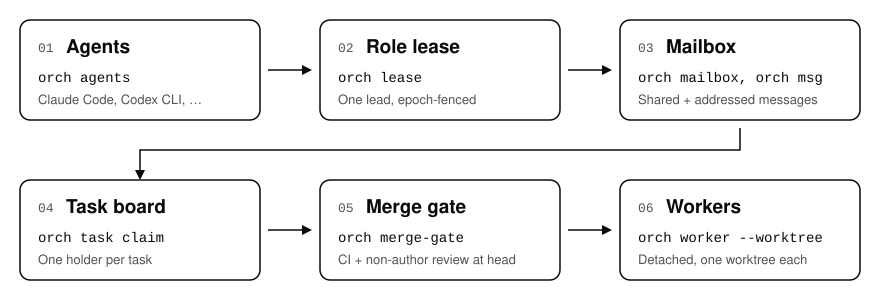

<p align="center">
  <picture>
    <source media="(prefers-color-scheme: dark)" srcset="assets/acephalt-logo-white-text.png">
    
  </picture>
</p>

<h3 align="center">ORCH-OS: A Team Layer for CLI Coding Agents</h3>

<p align="center"><a href="docs/concepts.md">Documentation</a> · <a href="docs/commands.md">Commands</a> · <a href="docs/faq.md">FAQ</a> · <a href="README.zh.md">中文</a></p>

<p align="center">
  <a href="https://github.com/Acephalt-Inc/orch-os/actions/workflows/ci.yml"></a>
  <a href="https://www.npmjs.com/package/orch-os"></a>
  <a href="LICENSE"></a>
</p>

ORCH-os helps several CLI coding agents work in one repository. A lease-held lead, shared mailbox, task board with exclusive claims, review-based merge gate, and detached workers give the team a common operating layer. It works alongside Claude Code, Codex CLI, and other command-line agents.

Author: [Winnicent Zuo](https://www.linkedin.com/in/winnicent-zuo/)

## Install

Requires Node.js 22 or newer (24 LTS recommended) on Windows 10 or 11, macOS, or Linux. Install the `orch` command globally, or run it once with `npx`:

```sh
npm i -g orch-os
# or: npx orch-os init
```

On Windows, install, init, doctor, memory, tasks, messages, agent discovery, and profiles work in PowerShell and cmd without a POSIX shell. Windows support for workers and review watch is not available yet; until then `worker start`, `worker stop`, and `review watch` refuse with one clear message. See [docs/windows.md](docs/windows.md).

## Why ORCH-os

One coding agent needs a prompt. A team of agents needs an operating layer: someone leads, work has one owner, messages are delivered and answered, a merge waits for a review by someone other than the author, and notes survive the session. ORCH-os provides that layer as local commands over plain files. You provide the agent accounts, and you make the final acceptance and merge decision.

## What ORCH-os provides

<p align="center">
  <picture>
    <source media="(prefers-color-scheme: dark)" srcset="assets/orch-os-architecture-dark.svg">
    
  </picture>
</p>

### Workflow and dispatch

| Feature | Command or file |
|---|---|
| One lead with an epoch-fenced lease | `orch lease` |
| Exclusive task claims and detached workers | `orch task`, `orch worker` |

### Review and merge gates

| Feature | Command or file |
|---|---|
| Gate on CI and reviews of the current PR head | `orch merge-gate` |
| Review comments for agents sharing one GitHub account | `orch review`, `orch merge-gate --reviews comments --task ID` |
| Start one non-author reviewer agent when CI is green at the PR head | `orch review watch` |

The comment-based option is a process gate between cooperating agents, not a security boundary: anyone with the account token can post under an agent name. The gate reports a verdict; it never merges the PR.

### Lease renewal and waiting

| Feature | Command or file |
|---|---|
| Renew a lead lease and wait for addressed messages | `orch lease renew`, `orch msg watch` |

### Resources

| Feature | Command or file |
|---|---|
| Sample machine load and refuse new workers at configured load levels | `orch load`, `orch worker start` |

### Logs

| Feature | Command or file |
|---|---|
| Worker output and process records | `orch worker`, `~/.orch/workers/` |

### Agent communication

| Feature | Command or file |
|---|---|
| Shared entries and addressed messages with acknowledgements | `orch mailbox`, `orch msg` |

### Local configuration

| Feature | Command or file |
|---|---|
| Declared review context: account, vendor and teammate labels you write. Declared, not verified | `[profile]` in `config.toml`, [docs/profiles.md](docs/profiles.md) |
| Show and edit the profile; label each review against the author's declared account and vendor | `orch profile` |

### Notes lifecycle

| Feature | Command or file |
|---|---|
| Add, search, and retire file-backed notes | `orch mem` |

### Policy and approvals

| Feature | Command or file |
|---|---|
| Require a label and current-head approval before a positive gate verdict | `orch merge-gate --label NAME` |
| Select the `human-merge` example policy: a review label you require, and a person performs every merge | `orch profile update --policy human-merge` |

### Local checks

| Feature | Command or file |
|---|---|
| Check local prerequisites | `orch doctor` |

### Load samples

| Feature | Command or file |
|---|---|
| Read local load samples | `orch load` |

### Agent discovery and worktrees

| Feature | Command or file |
|---|---|
| Find installed agent CLIs and place workers in separate Git worktrees | `orch agents`, `orch worker start --worktree` |

### Version and configuration

| Feature | Command or file |
|---|---|
| Show the installed version and resolved configuration | `orch --version`, `orch config` |

## Getting Started

In your repository, initialize ORCH-os, then point a lead session and a worker session in Claude Code or Codex CLI at the generated role files:

```sh
cd /path/to/repository
orch init
orch doctor
orch lease acquire --session lead
orch task claim first-task --as w1
```

The role files are `~/.orch/handbook/lead-boot.md` and `~/.orch/handbook/worker-boot.md`. See the [FAQ](docs/faq.md) for how to load them in either agent. With a one-off install, replace `orch` with `npx orch-os`.

## Commands

```sh
orch init                                   # Create config, mailbox, and role handbook
orch agents                                 # See detected and configured agent CLIs
orch doctor                                 # Check prerequisites
orch lease status                           # Show the lead lease
orch lease acquire --session lead           # Take the lead lease
orch mailbox read                           # Read shared mailbox entries
orch msg send QUESTION --as w1 --to lead -m "Need a decision"  # Send an addressed question
orch msg read --as lead                     # Read the lead's pending messages
orch task claim first-task --as w1          # Claim a task exclusively
orch worker start w1 --agent claude --worktree --task task.md  # Start a detached worker
orch worker list                            # Show workers
orch merge-gate 101 --fixture approved      # Try the gate with an offline fixture
orch load                                   # Sample machine load
orch mem search review                      # Search durable notes
```

Full flags and exit codes: [Command reference](docs/commands.md).

## Built for multi-agent work

The commands above apply a few rules. Each row names the command that applies it. These are rules between cooperating agents on one machine. They are not a sandbox: an agent with shell access can write outside its worktree, and account and vendor names are declared, not verified.

| Rule | Applied by |
|---|---|
| One lead at a time. A new holder increments the epoch, and a renewal from a fenced holder is refused. The check applies to callers of `orch`; it does not stop a process that does not call it. | `orch lease` |
| One owner per task. A claimed task cannot be taken until it is released or expires. An expired claim does not stop the earlier holder's process or its Git writes. | `orch task` |
| A message is data, not authority. Sender and type are stored outside the body, so a body cannot forge them. | `orch msg` |
| An approval binds to a commit. Reviews count only for the PR's current head, after CI at that head. | `orch merge-gate` |
| The gate reports; people merge. No `orch` command merges a PR. | `orch merge-gate` |
| The review label is explicit. Each reviewer is labelled against the authors from the declared tables (other vendor, other account, or same account in a fresh context); with a profile set, a reviewer below `required_review` is never substituted, the request is blocked instead. The label is not a measure of review quality. | `orch review watch`, `orch profile` |
| A tier is never guessed. The tier is `--tier` when given; else `high` when the profile has `high_paths` and a changed file matches or the file list cannot be read; else `default_tier`. A `--tier` or `default_tier` other than `low` or `high` is an error. A profile written for the removed built-in policy table is refused, not converted. | `orch merge-gate`, `orch profile` |
| Protect the machine, never kill work. High load refuses new workers; running ones are left alone. | `orch load`, `orch worker start` |
| Cleanup never destroys work. A worktree is removed only when Git reports nothing changed, untracked or ignored. | `orch worker stop` |
| Knowledge is superseded, not deleted. Retiring a note records its successor and keeps the file. | `orch mem retire` |

## Documentation

- [Concepts](docs/concepts.md) — roles, leases, messages, claims, workers, and notes.
- [Commands](docs/commands.md) — subcommands, flags, exit codes, and configuration.
- [Profiles](docs/profiles.md) — declared review context, the `human-merge` example policy, the review label each verdict reports, and migrating a profile written for the removed built-in table.
- [FAQ](docs/faq.md) — Claude Code and Codex CLI setup, GitHub identity, and common questions.
- [Architecture](docs/architecture.md) — modules, local state files, and process model.
- [Migration](docs/migration.md) — moving from v1.1 to v2.
- [Test map](docs/tests-map.md) — correspondence between v1.1 and v2 tests.
- [Demo](docs/DEMO.md) — a scripted offline walkthrough.

## License

ORCH-os is source-available. You may use it under either of two licenses, whichever fits you ([LICENSE](LICENSE)):

- **Individuals: free.** Personal, non-commercial use (learning, hobby projects, research) is free under the [PolyForm Noncommercial License 1.0.0](LICENSE-NONCOMMERCIAL).
- **Companies: free for internal use.** Any company or organisation may use it inside its own operations, including as engineering tooling for its own teams, under the [PolyForm Internal Use License 1.0.0](LICENSE-INTERNAL-USE).
- **Not allowed without a commercial license:** selling ORCH-os, hosting it as a service for others, or building it into a product you offer to others. Commercial licensing: winnicent.zuo@acephalt.com.

This summary is for convenience; the two license texts are what apply.

See also [NOTICE](NOTICE) and [AUTHORS](AUTHORS). To contribute, read [CONTRIBUTING.md](CONTRIBUTING.md) and [CLA.md](CLA.md).
