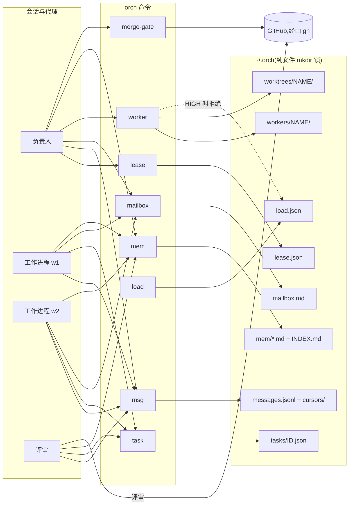

# ORCH-os

**让多个命令行编程代理像一个团队那样工作:一个负责人、定向消息、认领任务、一道合并闸门,以及跨会话保留的笔记。**

Author: Winnicent Zuo, Acephalt Inc. · [English](README.md) · [中文](README.zh.md)

## 快速上手

```sh
npx orch-os init          # 识别代理 CLI,写入 ~/.orch/config.toml、信箱和工作手册
npx orch-os doctor        # 逐项 PASS/FAIL 检查
npm i -g orch-os          # 或者长期安装 `orch` 命令
```

不用 npm 仓库时,直接从 GitHub 运行(首次运行时构建),或从克隆安装:

```sh
npx github:Acephalt-Inc/orch-os init
git clone https://github.com/Acephalt-Inc/orch-os && cd orch-os && sh install.sh
```

然后试一下。示例里的 `orch` 需要先全局安装才在 PATH 上;没有全局安装时,把 `orch` 换成 `npx orch-os`(`npx orch-os agents`、`npx orch-os lease acquire --session lead` 等):

```sh
orch agents                                    # 识别到、配置了哪些代理 CLI
orch lease acquire --session lead              # 当前终端成为负责人
orch task claim parser-fix --as w1             # w1 认领任务;其他人无法再认领
orch msg send QUESTION --as w1 --to lead -m "旧参数还保留吗?"
orch msg read --as lead                        # 负责人未确认的消息
orch worker start w1 --agent claude --worktree --task task.md   # 在独立 git worktree 里运行的后台工作进程
orch merge-gate 101 --fixture approved         # 离线演示合并闸门
orch mem add review-at-head -t rule -d "只有针对当前 head 提交的批准才算数"
```

需要 Node.js 20 及以上,macOS 或 Linux。运行时零依赖。从克隆安装见[安装](#安装)。

## 它做什么,帮谁

ORCH-os 面向已经在用命令行编程代理(Claude Code、Codex CLI、Gemini CLI 等)、并且开始**在同一个仓库里同时跑多个代理**的人。多个代理会带来单个代理没有的问题:

| 多代理的问题 | ORCH-os 的做法 |
|---|---|
| 两个终端都以负责人自居,指令互相矛盾 | **角色租约**:同一时间只有一个会话持有负责人角色。要从未过期的持有者手里接管必须加 `--force`;每换一次持有者,纪元(epoch)加一,旧持有者随即被隔离。 |
| 代理之间的问题丢失,没人知道哪些已答复 | **定向消息**(`orch msg`):`QUESTION`、`ANSWER`、`DONE`、`BLOCKED` 四种类型,发给某个名字或所有人;每个读者有自己的读取游标和确认(ack);`msg watch` 等待下一条。 |
| 两个工作进程拿到同一个任务 | **任务认领**(`orch task`):每个任务只有一个持有者,用纪元做隔离;已被认领的任务在释放或过期前无法被抢走。 |
| 工作进程互相覆盖文件 | **每个工作进程一个 git worktree**:`orch worker start --worktree` 给每个工作进程独立的分支和目录;`stop` 只在工作区干净时才删除它。 |
| PR 凭旧提交上的批准、或作者自己批准就被合并 | 基于 GitHub 评审的**合并闸门**:CI 全绿,足够数量的非作者批准且批准针对 PR 当前的 head 提交,没有未解决的"要求修改"。 |
| 后台代理成了孤儿进程、一直跑、停不干净 | **工作进程**:每个都是独立进程组里的后台进程,带时限、nice 优先级和日志目录;停止时信号送达整个进程组。 |
| 多个代理加测试把机器压垮 | **负载调节器**:按每核负载和交换区(可选温度)分四档,带迟滞。负载为 HIGH 时拒绝启动新工作进程。 |
| 每个会话都从零开始 | **长期笔记**(`orch mem`):每条规则或经验一个 Markdown 文件;会话开始时读取的索引有行数上限;用"标记退役并记录替代者"代替删除。 |
| 每个团队都要重新定义代理该怎么做事 | **工作手册**:`orch init` 写入四个文件:负责人、工作进程、评审三个角色的启动文件,以及共同协议,适用于 Claude Code、Codex CLI 或任何读取指令文件的代理。 |

ORCH-os 不替代你的代理。它决定谁负责、代理之间怎么沟通、谁拥有哪个任务、工作进程在哪里跑、团队长期记住什么,以及一个 PR 能否合并。

## 功能

| 功能 | 命令 | 说明 |
|---|---|---|
| 初始化 | `orch init`、`orch agents` | 在 PATH 和 cron 看不到的常见安装目录里找已知代理 CLI;用绝对路径写入 `[agents.*]`;写入信箱和工作手册。 |
| 健康检查 | `orch doctor` | 每项前提一行 PASS/FAIL/SKIP;任一必需项 FAIL 则退出码为 1。 |
| 角色租约 | `orch lease status\|acquire\|renew\|release` | 加锁串行写入,读回校验,纪元隔离(续约和释放都可校验),以存储的到期时间判断是否有效。 |
| 信箱 | `orch mailbox post\|read` | 一个 Markdown 文件里的广播笔记;每个角色一节;加锁写入。 |
| 消息 | `orch msg send\|read\|ack\|watch` | 定向、带类型、每个读者独立的游标和确认;JSON 行存储,消息正文无法伪造其他消息。 |
| 任务认领 | `orch task claim\|renew\|release\|status\|list` | 每个任务一份租约:独占、纪元隔离、不会被重复认领。 |
| 合并闸门 | `orch merge-gate <pr>` | CI + 当前 head 上的非作者批准 + 无"要求修改";可选必需标签。在线模式用 `gh`,离线模式用内置样例。 |
| 工作进程 | `orch worker start\|list\|stop` | 独立进程组、时限、nice、任务从 stdin 传入、日志;可选每个工作进程一个 git worktree。 |
| 负载调节器 | `orch load` | NORMAL/BUSY/HIGH/CRITICAL 四档,带迟滞;从不杀进程。 |
| 笔记 | `orch mem add\|search\|retire` | 每条一个带 frontmatter 的文件;自动生成且有上限的 `INDEX.md`;退役保留文件并记录替代者。 |
| 配置 | `orch config` | 打印解析后的 `~/.orch/config.toml`。 |

## 架构



每条命令都是一个短命进程:读配置、加锁、原子地改一个文件、退出。详见 [docs/architecture.md](docs/architecture.md)。

## 安装

| 方式 | 命令 |
|---|---|
| npm,一次性 | `npx orch-os init` |
| npm,全局 | `npm i -g orch-os`(不用 sudo:`npm i -g --prefix ~/.local orch-os`) |
| GitHub,不经 npm 仓库 | `npx github:Acephalt-Inc/orch-os init`(首次运行时从源码构建;要长期可用的 `orch`,请从克隆安装) |
| 从克隆安装 | `npm install && npm run build && npm i -g .`,或 `sh install.sh` |
| 从仓库直接安装,不克隆 | `curl -fsSL https://raw.githubusercontent.com/Acephalt-Inc/orch-os/main/install.sh \| ORCH_OS_GH_REPO=Acephalt-Inc/orch-os sh`(公开仓库),私有仓库改用 `gh api -H "Accept: application/vnd.github.raw" repos/Acephalt-Inc/orch-os/contents/install.sh` |

`install.sh` 会找 Node.js ≥ 20,获取源码(它所在的检出目录;否则 `ORCH_OS_REPO`;否则当前目录;否则经 `gh` 或 https 获取 `ORCH_OS_GH_REPO`),缺 `dist/` 时先构建,复制到 `~/.orch/lib/orch-os`,并把启动脚本写到 `~/.local/bin/orch`。它从不改动已存在的 `config.toml`。`ORCH_INIT=1` 会顺带执行 `orch init && orch doctor`。

无论哪种方式,之后都执行 `orch init`,再执行 `orch doctor`。没装任何代理 CLI 时 doctor 仍然通过:代理相关行显示 SKIP,工作进程可以运行 `--` 之后给出的任意命令。

## 工作手册

`orch init` 把四个文件写到 `~/.orch/handbook/`(用 `--dir` 指定别处,`--layout skills` 则写成 `NAME/SKILL.md` 目录):

| 文件 | 用途 |
|---|---|
| `lead-boot.md` | 启动负责人会话:拿租约、补齐状态、先答复未决问题、分派工作、进入循环 |
| `worker-boot.md` | 启动工作进程会话:先认领再动手、在自己的 worktree 里工作、带证据报告 DONE |
| `review-boot.md` | 启动评审会话:在当前 head 上独立评审、修复轮规则、把结论记录到闸门读取的位置 |
| `protocols.md` | 共同规则:消息类型、认领、DONE 报告、合并规则、笔记、安全底线 |

让每个会话读取自己角色的文件(Claude Code 与 Codex CLI 的用法见 [docs/faq.md](docs/faq.md))。

## 仓库结构

| 路径 | 内容 |
|---|---|
| `src/cli.ts`、`src/args.ts` | `orch` 命令及其参数解析 |
| `src/config.ts`、`src/toml.ts` | 默认 `config.toml`、`ORCH_HOME` 解析、TOML 读取器 |
| `src/lock.ts` | 基于 mkdir 的跨进程锁 |
| `src/lease.ts`、`src/tasks.ts` | 角色租约;任务认领(每个任务一份租约) |
| `src/mailbox.ts`、`src/messages.ts` | 广播信箱;带游标的定向消息 |
| `src/mergegate.ts` | 针对 head 提交的评审判定、CI 与标签规则、`gh` 拉取 |
| `src/workers.ts`、`src/load.ts` | 后台工作进程与 worktree;负载采样与分档 |
| `src/mem.ts`、`src/handbook.ts` | 笔记存储;工作手册写入 |
| `src/pyjson.ts`、`src/detect.ts`、`src/util.ts` | 与 v1.1 兼容的 JSON 格式;代理识别;工具函数 |
| `templates/handbook/` | 四个工作手册文件 |
| `fixtures/` | 离线 `merge-gate --fixture` 用的 PR 状态样例 |
| `tests/` | vitest 测试:v1.1 的每个测试一一移植,外加 v2 新测试 |
| `install.sh`、`scripts/demo.sh` | 从仓库安装的脚本;5 分钟离线演示 |

## 文档

| 文档 | 内容 |
|---|---|
| [docs/concepts.md](docs/concepts.md) | 角色、租约与纪元、消息、认领、批准与 head 提交、工作进程与 worktree、负载分档、笔记、失败即拒绝 |
| [docs/architecture.md](docs/architecture.md) | 模块、状态文件、锁、进程模型、依赖、刻意不做的事 |
| [docs/commands.md](docs/commands.md) | 每个子命令、参数、退出码和配置项 |
| [docs/faq.md](docs/faq.md) | 配合 Claude Code 或 Codex CLI 使用、只有一个 GitHub 账号、不用 GitHub、定时运行 |
| [docs/migration.md](docs/migration.md) | 从 v1.1(Python)迁移到 v2 |
| [docs/tests-map.md](docs/tests-map.md) | v2 的哪个测试移植了 v1.1 的哪个测试 |
| [docs/DEMO.md](docs/DEMO.md) | 5 分钟脚本化演示 |

## 测试

```sh
npm install
npm test          # 先 tsc,再 vitest(单个子进程,测试文件顺序执行)
```

## 许可证

ORCH-os 源码公开(source-available)。你可以在以下两份许可证中任选一份适合你的来使用([LICENSE](LICENSE)):

- **个人:免费。** 个人的非商业使用(学习、业余项目、研究)免费,依据 [PolyForm Noncommercial License 1.0.0](LICENSE-NONCOMMERCIAL)。
- **公司:内部使用免费。** 任何公司或组织都可以在自己内部使用,包括作为本团队的工程工具,依据 [PolyForm Internal Use License 1.0.0](LICENSE-INTERNAL-USE)。
- **未取得商业许可不得:** 出售 ORCH-os、把它作为服务托管给他人,或把它做进你提供给他人的产品。商业许可:hello@acephalt.com。

以上仅为便于理解的摘要;以两份许可证原文为准。

另见 [NOTICE](NOTICE) 和 [AUTHORS](AUTHORS)。参与贡献请先读 [CONTRIBUTING.md](CONTRIBUTING.md) 和 [CLA.md](CLA.md)。
